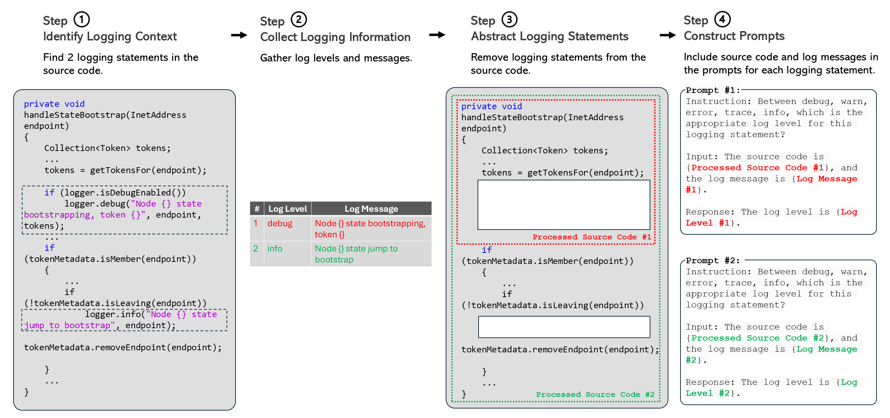
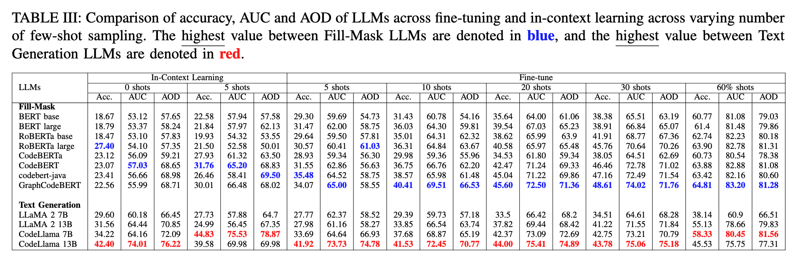
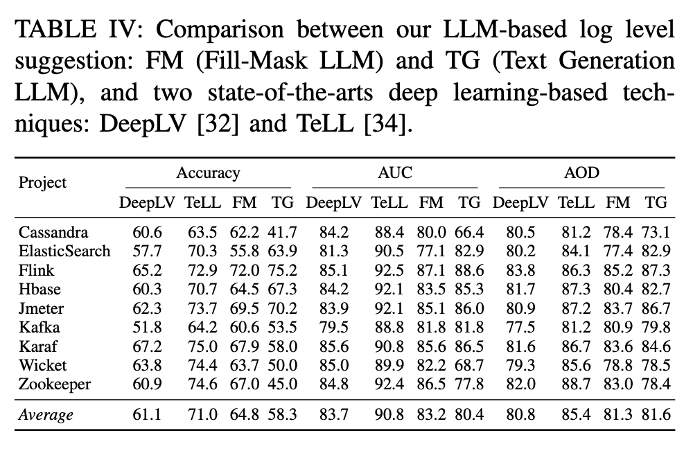
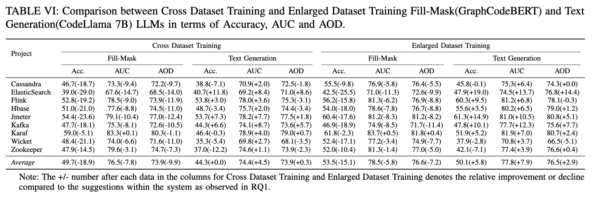

# LibreLog: Accurate and Efficient Unsupervised Log Parsing Using Open-Source Large Language Models

This repo is the package for "Benchmarking Open-Source Large Language Models For Log Level Suggestion".

## Study Design

<p align="center"></p>


## Structure
We present the repository structure below.

```
.
├── README.md
├── docs
│   └── overview_diagram.pdf
├── evaluation
│   ├── RQ1
│   │   └── RQ1.png
│   ├── RQ2
│   │   └── RQ2.png
│   ├── RQ3
│   │   ├── RQ3.png
├── full_dataset
│   └── files_list.json
│   └── README.md
├── models
│   └── README.md
├── parser
│   ├── finetune.py
│   ├── fillmask_prompt.py
│   ├── textgen_prompt.py
│   ├── process_results.py
├── parsing.sh
├── requirements.txt
└── results
    ├── 
    ├── 
    ├── 
    ├── 
    └── 
```


## Requirement 

```shell
pip install -r requirements.txt
```

## Models download

Please download the base LLMs from links in [GitHub](https://github.com/LogLevelLLM/LogLevelLLM/tree/main/models).


## Datasets download

Please first download the full datasets from links in [GitHub](https://github.com/LogLevelLLM/LogLevelLLM/tree/main/data).


## Instructions:
1. Run directory.txt to create the folders.
2. Run sampling.py to prepare the data.
3. Run generate_command.py to generate the python commands needed to finetune and generate results.
4. Run RQ1_results.py, RQ2_results.py, RQ3_results.py to process the results. 


## Evaluation Results
### RQ1: What is the accuracy of LLMs in suggesting log level? 
<p align="center"></p>

### RQ2: How effective is including additional context help in log level suggestion?
<p align="center"></p>

### RQ3: How is the generalizability of LLMs in suggesting log levels?
<p align="center"></p>